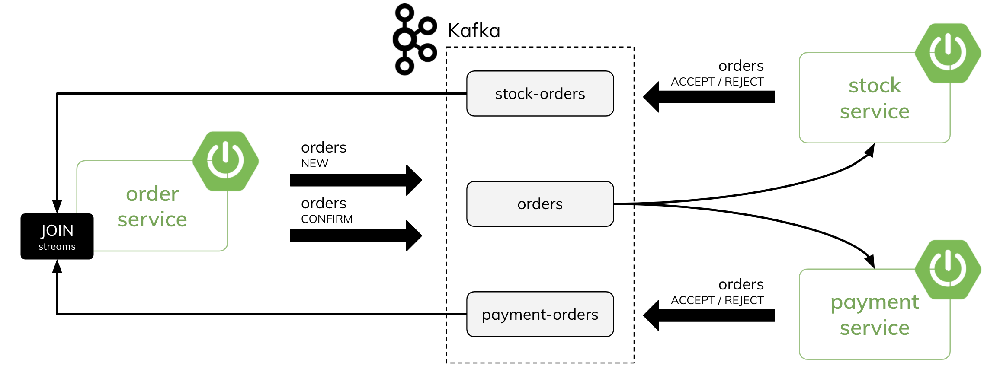

# Distributed Transactions in Microservices with Kafka Streams and Spring Boot


## Description
There are three microservices: \
`order-service` - it sends `Order` events to the Kafka topic and orchestrates the process of a distributed transaction \
`payment-service` - it performs local transaction on the customer account basing on the `Order` price \
`stock-service` - it performs local transaction on the store basing on number of products in the `Order`

Here's the diagram with our architecture:



(1) `order-service` send a new `Order` -> `status == NEW` \
(2) `payment-service` and `stock-service` receive `Order` and handle it by performing a local transaction on the data \
(3) `payment-service` and `stock-service` send a reponse `Order` -> `status == ACCEPT` or `status == REJECT` \
(4) `order-service` process incoming stream of orders from `payment-service` and `stock-service`, join them by `Order` id and sends Order with a new status -> `status == CONFIRMATION` or `status == ROLLBACK` or `status == REJECTED` \
(5) `payment-service` and `stock-service` receive `Order` with a final status and "commit" or "rollback" a local transaction make before


## Run application

* Use docker to deploy kafka with registry.

Set docker host ip

```sh
export DOCKER_HOST_IP=127.0.0.1
```

or on windows powershell

```powershell
$env:DOCKER_HOST_IP = "127.0.0.1"
```

```shell
docker compose -f zk-single-kafka-multiple-schema-registry-ui.yml up -d
```

Open UI for Apache Kafka at [Kafka Control Center ](http://localhost:9021/).

* Run gradle build to generate avro source files

```shell
cd common-lib
gradle clean build
```

* Run application
    * order-service

  ```shell
  cd order-service
  gradle clean bootRun
  ```
  Open [swagger-ui](http://localhost:8080/swagger-ui/index.html).
    * payment-service

  ```shell
  cd payment-service
  gradle clean bootRun
  ```
    * stock-service

  ```shell
  cd stock-service
  gradle clean bootRun
  ```

* Use following request to generate orders

```shell
curl --location --request POST 'http://localhost:8080/orders/generate'
```

* Use following request to check orders status

```shell
curl --location --request GET 'http://localhost:8080/orders'
```

## Stop application

* Use ctrl+c to cancel running applications
* Use following command to stop and remove kafka containers

```shell
docker compose -f zk-single-kafka-multiple-schema-registry-ui.yml down
```

## Kubernetes Deployment

* Start kafka

```shell
helm repo add confluentinc https://confluentinc.github.io/cp-helm-charts/
helm repo update
helm install my-kafka -f ./k8s/kafka/values.yaml confluentinc/cp-helm-charts
```

* Application Deployment

```shell
gradle clean dockerTag
kubectl apply -f ./k8s/zipkin
kubectl apply -f ./k8s/app
```

* Use following request to generate orders

```shell
curl --location --request POST 'http://localhost:30001/orders/generate'
```

* Use following request to check orders status

```shell
curl --location --request GET 'http://localhost:30001/orders'
```

* Clean up

```shell
kubectl delete -f ./k8s/app
kubectl delete -f ./k8s/zipkin
helm delete my-kafka
```

* Expose Confluent Control Center via NodePort

```shell
kubectl patch svc my-kafka-cp-control-center --type='json' -p '[{"op":"replace","path":"/spec/type","value":"NodePort"}]'
```

## Reference

* [Spring Boot Kafka](https://github.com/ashutoshsahoo/gs-spring-boot-kafka)
* [Distributed Transactions in Microservices with Kafka Streams and Spring Boot](https://piotrminkowski.com/2022/01/24/distributed-transactions-in-microservices-with-kafka-streams-and-spring-boot/)
* [Kafka Streams Data Types and Serialization](https://docs.confluent.io/platform/current/streams/developer-guide/datatypes.html)
* [Confluent Platform Helm Charts](https://github.com/confluentinc/cp-helm-charts)
